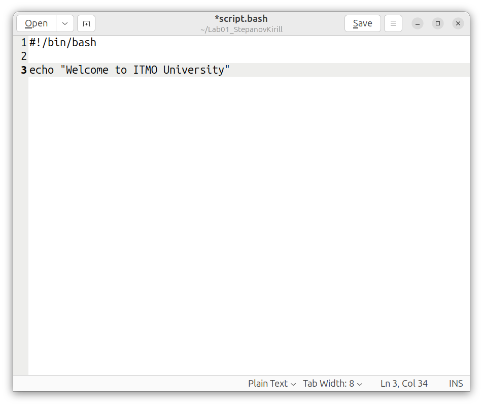

#Отчет по лабораторной работе 1 by Stepanov Kirill
Для выполнения работы был скопирован репозиторий с заданием к себе на машину, используя терминал (ctrl+alt+T) и введя команду git clone:

После чего я создал и отредактировал файл script.bash с помощью команд touch - создал; gedit - отредактировал (предварительно мне пришлось его скачать):

Потом я сохранил изменения в файле:

И запустил его через терминал с помощью команды bash:

Далее была задача модифицировать файл script.bash так, чтобы он работал для любых имен, я решил эту проблему. Нужно просто чтобы аргументы, передававшиеся из командной строки терминала при запуске выводились в одну строчку. В этом помогает "$*".
Таким образом мы просто вместо echo "Welcome to ITMO University" написали в скрипте "Welcome, $*"
На скриншоте я продемонстрировал что будет, если просто ввести пробел, либо ввести любое сообщение.

И в завершение лабораторной работы я произвел команды git add для переноса изменений из рабочего каталога и фиксируем их с помощью git commit , а затем запушиваем в мэйн.
Я столкнулся с небольшой проблемой, которая требовала авторизации, думаю это из-за того, что я клонировал через ссылку http, а не ssh ключ. Но в целом работа завершена успешно.

